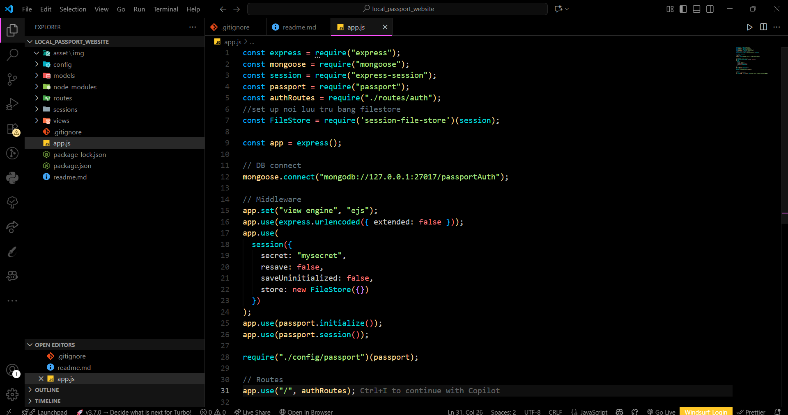
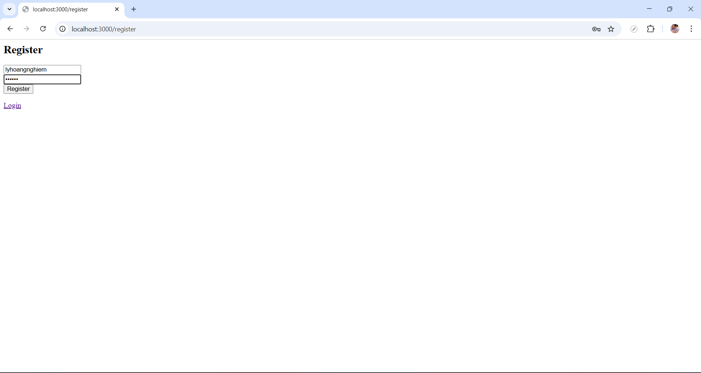
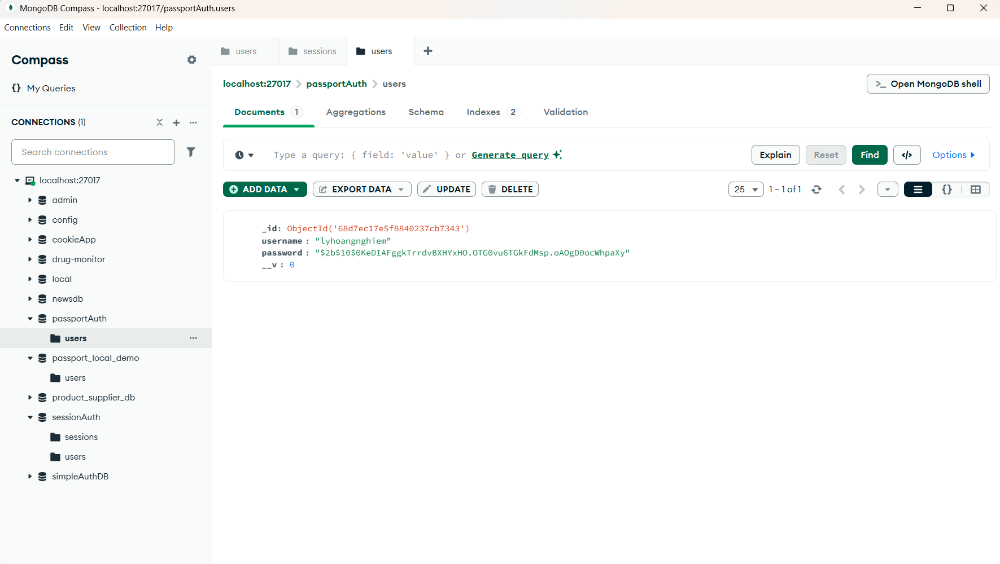
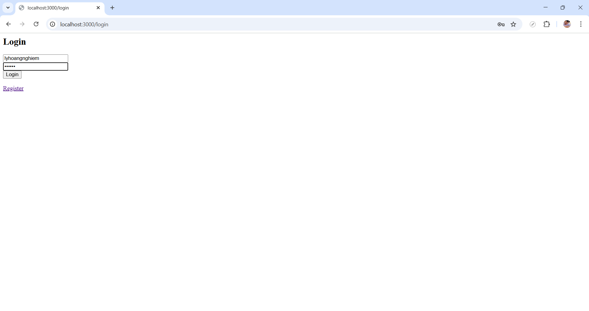
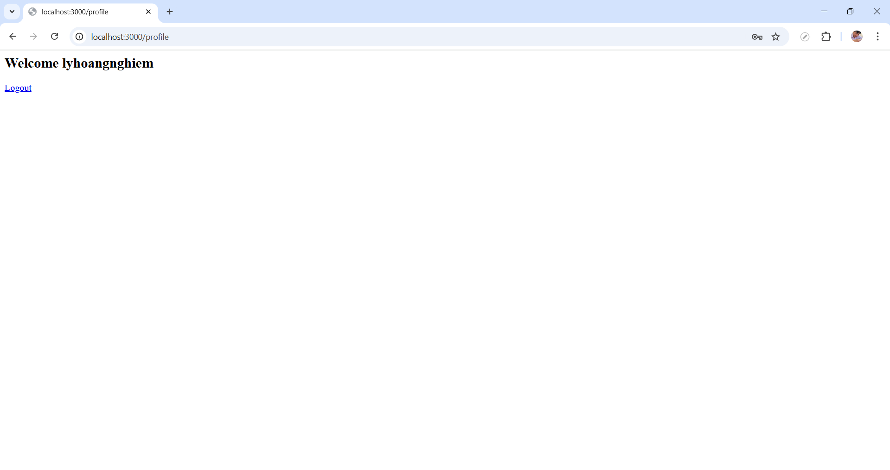
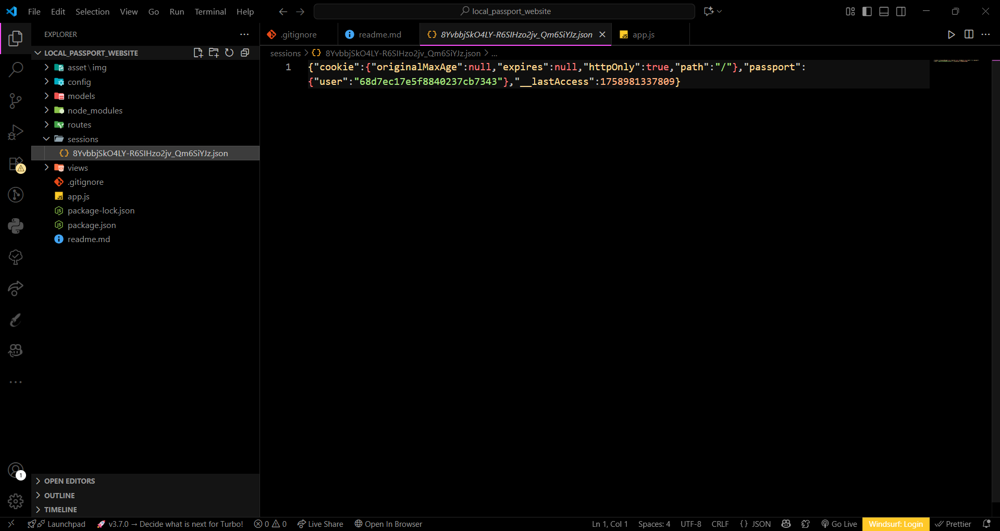
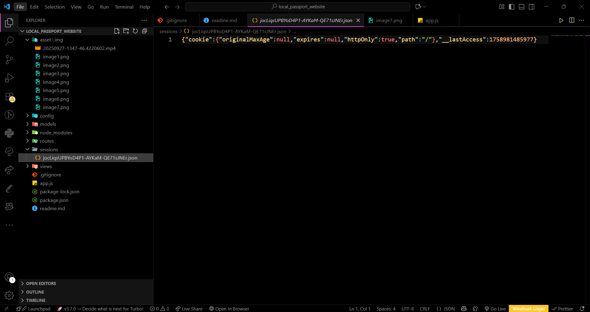
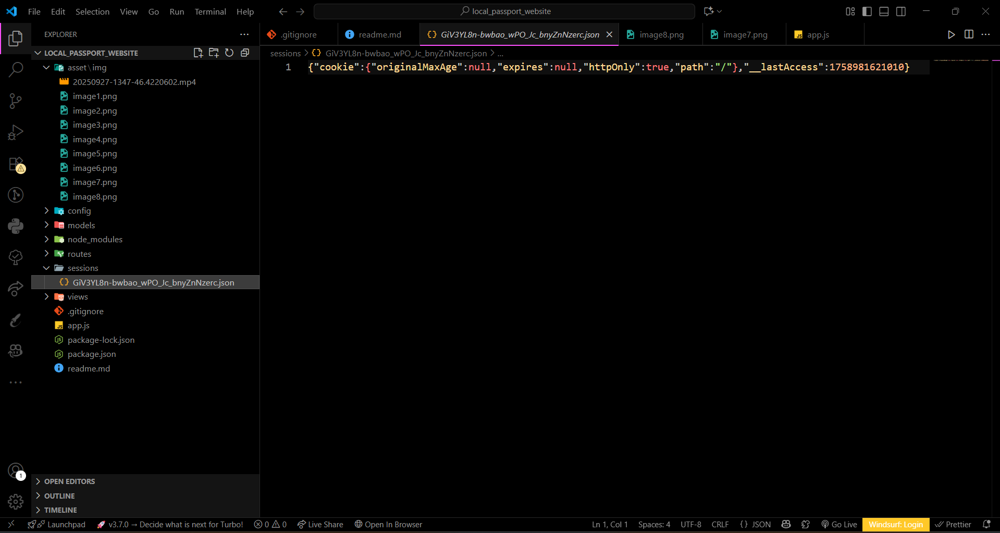

# 🌐 Local Passport Website

---

## 📑 Mục lục

- [⚙️ Cài đặt & Chạy dự án](#️-cài-đặt--chạy-dự-án)
- [⚙️ Set Up Session với FileStore](#️-set-up-nơi-lưu-trữ-cho-session-bằng-filestore)
- [🚫 Truy cập `/profile` khi chưa đăng nhập](#-truy-cập-profile-khi-chưa-đăng-nhập)
- [📝 Tạo tài khoản](#-tiến-hành-tạo-tài-khoản)
- [🔑 Đăng nhập](#-đăng-nhập-trên-website)
- [💾 Lưu trữ Session trong FileStore](#-lưu-trữ-thông-tin-đăng-nhập-ở-filestore)
- [🚪 Đăng xuất](#-đăng-xuất)

---

## ⚙️ Cài đặt & Chạy dự án

### 📦 Cài đặt dependencies

```bash
npm install
```

### 📂 Cài đặt session-file-store

```bash
npm install session-file-store
```

### ▶️ Chạy dự án

```bash
node app.js
```

---

## ⚙️ Set Up nơi lưu trữ cho session bằng **FileStore**

📸 Minh họa: 

---

## 🚫 Truy cập `/profile` khi chưa đăng nhập

🎥 Demo: <video controls src="./asset/img/1.gif" title="Demo"></video>

👉 **Kết quả:**
Bị chuyển hướng lại trang **login** vì chưa đăng nhập.

---

## 📝 Tiến hành tạo tài khoản

- Thông tin test:

  ```json
  {
    "username": "lyhoangnghiem",
    "password": "123456"
  }
  ```

📸 Giao diện tạo tài khoản: 

### ✍️ Tạo tài khoản thông qua giao diện website



### 🗄️ Kiểm tra database đã có thông tin chưa



---

## 🔑 Đăng nhập trên website

- Thông tin test:

  ```json
  {
    "username": "lyhoangnghiem",
    "password": "123456"
  }
  ```

📸 Giao diện đăng nhập: 

### ✅ Khi đăng nhập thành công → vào **trang chủ**



---

## 💾 Lưu trữ thông tin đăng nhập ở FileStore

📸 Kết quả khi đăng nhập thành công: 

### ❌ Khi đăng nhập thất bại (sai mật khẩu)



---

## 🚪 Đăng xuất

👉 Sau khi đăng xuất:

- Session trong **FileStore** bị xóa ✅
- Người dùng bị chuyển hướng về trang login.

📸 Minh họa: 
